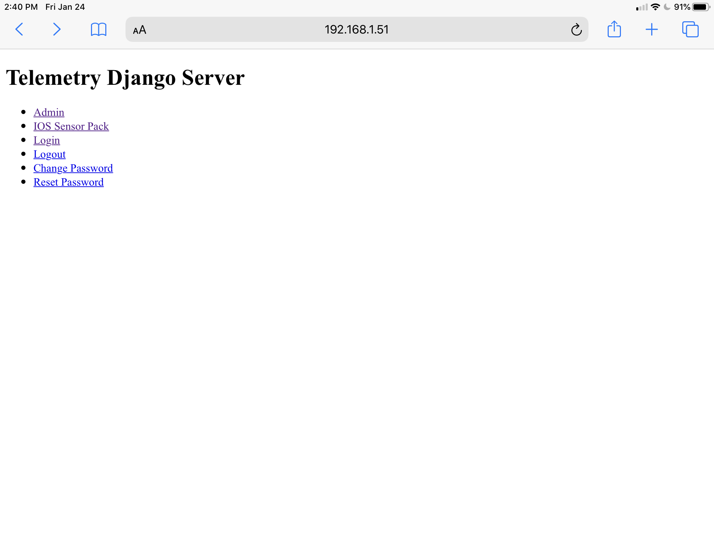
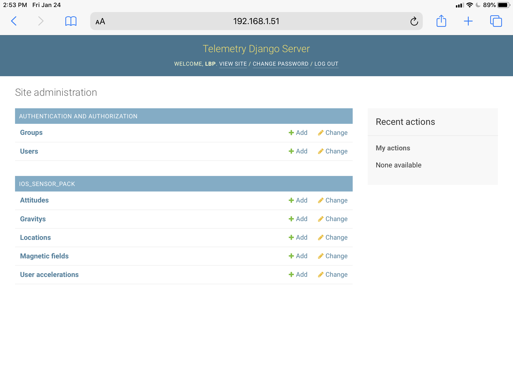
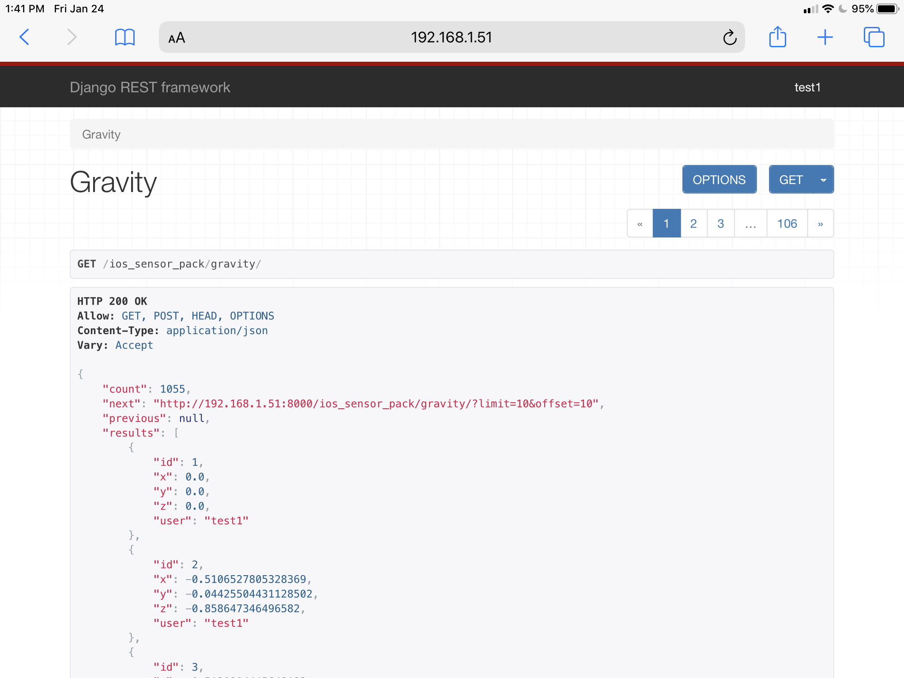

# telemetry-django-server

## Python REST server based on Django and Django Rest Framework

### ```telemetry_django_server``` Dependencies

* ```python3.8 -m pip install django```
* ```python3.8 -m pip install djangorestframework```
* ```python3.8 -m pip install markdown       # Markdown support for the browsable API.```
* ```python3.8 -m pip install django-filter  # Filtering support```
* ```python3.8 -m pip install django-admin-search```

### ```ios_sensor_pack``` Specific Dependencies

* ```python3.8 -m pip install numpy```
* ```python3.8 -m pip install astropy```
* ```python3.8 -m pip install pytz```

## Running Server

The following ```python3.8``` commands require the account issuing the commands have write permissions on the local copy of the repository.

* The ```telemetry-django-server/src/telemetry_django_server``` directory to allow the ```settings.py``` file to write the ```secret.py``` file.
* The ```telemetry-django-server/src/ios_sensor_pack``` where ```makemigrations``` will create a ```migrations``` directory containing instructions for required to create database tables.

The following commands must be run from the repository's ```telemetry-django-server/src``` directory where the ```manage.py``` file is foundtelemetry-django-server.

### Create Dataabase

```bash
python3.8 manage.py makemigrations ios_sensor_pack
python3.8 manage.py migrate
```

### Create Superuser

```bash
python3.8 manage.py createsuperuser
```

### Create Test User

```bash
python3.8 manage.py shell
```

Then in the shell, add the following python code:

```python
from django.contrib.auth import get_user_model
UserModel = get_user_model()
user = UserModel.objects.create_user('test1', 'someone@anemailaddress.com', 'telemetry')
user.save()
# check to see if the user was actually created
users = UserModel.objects.all()
for user in users:
    print(user)
```

You should see both your ```superuser``` and your ```test1``` user.

### Run The Django Test/Development Server

The following runs the test/development server so that it is only accessible on this computer.

```bash
python3.8 manage.py runserver
```

To run the test/development server so that it is accessible from outside you computer (e.g. from an iPhone or iPad running the Pythonista application or web browser), start the server this way:

```bash
python3.8 manage.py runserver 0.0.0.0:8000
```

### Web Browser Access

The **Telemetry Django Server** can be accessed via a web browser as shown below.

* Accessing from a web browser on the same machine as the server use [http://127.0.0.1:8000](http://127.0.0.1:8000)
* Using a web browser to access the server from another host, see the section below on **Access From Another Computer**.



From the home page, there are two sections of interest - [Admin](http://127.0.0.1:8000/admin/) and [IOS Sensor Pack](http://127.0.0.1:8000/ios_sensor_pack/).

#### Admin

[Admin](http://127.0.0.1:8000/admin/) is an administrative interface for users like the superuser (see the **Create Superuser** section above).  Access to this area requires the superuser username and password.


Once logged in, a superuser will see the following interface.



The administrative landing page provides links:

* [Users](http://127.0.0.1:8000/admin/auth/user/) - User administration page where users can be added, be deleted, granted permissions, disabled and passwords reset.
* [IOS_SENSOR_PACK](http://127.0.0.1:8000/admin/ios_sensor_pack/) section where IOS sensor data can be created, destroyed, modified or browsed.

#### IOS Sensor Pack

Developers may want to explore the [IOS Sensor Pack](http://127.0.0.1:8000/ios_sensor_pack/) API's with their web browser.  The web browser will see a web browser version of the REST API's exposed by the web server.  When doing development work, browser access to the same REST API interface is extremely useful.

The web interface uses a different authentication mechanism than the REST API's used by the [telemetry-pythonista](https://github.com/thatlarrypearson/telemetry-pythonista) client program.  As a result, before accessing the [IOS Sensor Pack](http://127.0.0.1:8000/ios_sensor_pack/) pages, the web browser will need to [login](http://127.0.0.1:8000/accounts/login/) first.

The [Gravity API](http://127.0.0.1:8000/ios_sensor_pack/gravity/) is shown below.



### Access From Another Computer

The hosts's IP address is needed to access the server from another computer, phone or tablet.  After running the correct command for your operating system, you may have to pick through a list of network interfaces to find the correct one.  Use that address on the other computer.

* Windows 10

  ````PowerShell
  ipconfig
  ````

  In the following screen shot, look for the section ***Wireless LAN adapter Wi-Fi***.  Under that heading, see the line starting with ```IPV4 Address```.  In this case, the IPV4 address is ```192.168.1.51```.

  
* Linux

  ````bash
  hostname -I
  ````

  
* Apple Mac

  ````bash
  ifconfig -a
  ````

If, for example, your server's IP address turned out to be ```192.168.1.51```, then the base URL for the web server will be ```http://192.168.1.51:8000/```.

## ```ALLOWED_HOSTS```

Because the client software runs on a computer separate from the server machine, testing changes in the server code using ```python3.8 manage.py runserver 0.0.0.0:8000``` will require adding the host's IP address to ```ALLOWED_HOSTS``` in the ```settings.py``` file.


If you are developing on the same host machine as the web server, consider adding ```127.0.0.1``` to the ALLOWED_HOSTS as shown below.  This will enable a browswer or client on the web server machine to access the website locally.

```python
ALLOWED_HOSTS = ['192.168.1.51', '127.0.0.1', ]
```

## Compatible Python Clients

### Pythonista Client

[Pythonista 3](https://apps.apple.com/us/app/pythonista-3/id1085978097) is an Apple IOS application that runs on iPhones and iPads.   The current Pythonista 3 implements Python 3.6 which works fine for this particular application.  The client repository is [telemetry-pythonista](https://github.com/thatlarrypearson/telemetry-pythonista).

#### Pythonista Companion Server Application

The server Django code module (application) supporting the Pythonista client is ```ios_sensor_pack``` which is included in this repository.

## ```ios_sensor_pack``` Evaluation

A survey of motion data analysis techniques indicated that motion data samples should ideally be made in the 40,000 Hz range.  In other words, the average time between samples should be around 2.5 X 10**(-5) or two point 5 times ten to the minus fifth power.

Eyeballing the actual time between samples to be around 1 to 4 seconds which was too slow by more than four orders of magnitude.

The following code can be run on the server to provide average time between samples to see just how good or bad things are.

```bash
python3.8 manage.py shell
```

Run the following python inside the Django shell.

```python
from statistics import mean, median, stdev, quantiles
from ios_sensor_pack.models import Location
locations = Location.objects.all().order_by('id')
old_timestamp = None
time_difference_list = []
for location in locations:
  if old_timestamp:
    time_difference = location.sat_timestamp - old_timestamp
    time_difference_seconds = time_difference.total_seconds()
    time_difference_list.append(time_difference_seconds)

  old_timestamp = location.sat_timestamp

print("min: %s\nmax:%s\nmean: %s\nmedian: %s\nstdev: %s\nquantiles: %s" % (
      str(min(time_difference_list))
      str(max(time_difference_list))
      str(mean(time_difference_list)),
      str(median(time_difference_list)),
      str(stdev(time_difference_list)),
      str(quantiles(time_difference_list)),
    )
  )
```

### Webserver and SQLite Database Running On Windows 10

* Intel Core i7-6700HQ CPU @ 2.60 GHz
* 16 GB RAM
* Ran on development environment.  E.g. '```manage.py runserver```'.

The results were ```0:00:03.206183```, roughly 3.2 seconds on average between each sample.  Not exactly promising.  Some of the performance issues are a result of running on the development environment.

### Webserver and SQLite Database Running On Raspberry Pi 3

* Ran on development environment.  E.g. '```manage.py runserver```'.

```text
min: 10.000112
max: 59.008395
mean: 22.761373432432432
median: 21.000098
stdev: 10.80137236324451
quantiles: [15.000168, 21.000098, 26.502295500000002]
```

### Webserver and PostgreSQL Database Running On Raspberry Pi 3

* Ran on development enviornment. E.g. '```manage.py runserver```'.

```text
min: 8.984529
max: 93.376197
mean: 24.951352907407408
median: 22.5035315
stdev: 16.27516967176818
quantiles: [13.00013025, 22.5035315, 28.252490249999997]
```

## PostgreSQL Database Engine

Wherever the web server runs, glue code is required for the Django code to communicate with the PostgreSQL database engine.  In many cases, it may be enough to just pip install the following.

```bash
sudo python3.8 -m pip install psycopg2
```

If the installation fails, additional development tools may be required.  Depending on the PostgreSQL server version, the version number on the tail end of ```postgresql-server-dev-??``` will need to match the version available on your system.

```bash
sudo apt-get install postgresql-server-dev-10
```

If this is insufficient to get ```pip``` to install ```psycopg2```, installing the following may help.

```bash
sudo apt-get update
sudo apt-get upgrade -y
sudo apt-get install -y build-essential checkinstall
sudo apt-get install -y libreadline-gplv2-dev libncursesw5-dev libssl-dev
sudo apt-get install -y libsqlite3-dev tk-dev libgdbm-dev libc6-dev libbz2-dev libffi-dev zlib1g-dev
```
